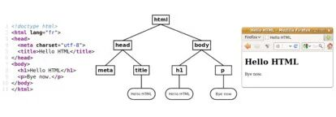

# ST-16 - Maîtriser la taille du DOM

## Description

Le DOM peut se définir de façon simplifiée comme un ensemble de balises HTML ou XML décrivant la structure de la page chargée par le navigateur. Plus le DOM est complexe, c’est-à-dire plus il comporte de balises, plus il faut de puissance (RAM et CPU) pour l'afficher. Ainsi, plus la puissance pour afficher la page est importante et plus cela contribue à raccourcir la durée de vie de l'ordinateur sur lequel il s'exécute et plus la consommation d’énergie associée à l’utilisation du service numérique est importante. Ces deux conséquences entrainent des impacts environnementaux non négligeables. Limiter la complexité de la page est donc la taille du DOM est donc primordial.

A ce sujet, selon le [guide des développeurs web de Google](https://web.dev/dom-size/), un arbre de DOM optimal inclut les caractéristiques suivantes :

- Moins de 1500 éléments au total (voire, si possible, moins de 800 éléments)
- Une profondeur maximale de 32 éléments
- N’a pas d’élément parent avec plus de 60 éléments enfants

## Mise en œuvre

En tant qu’équipe produit, je définis le nombre maximum d’éléments du DOM que ma page ne doit pas dépasser lors de la session de travail sur les indicateurs.

En tant que développeur, j'utilise un outil en capacité de m’informer sur le nombre d’éléments du DOM . 

L’application de certaines bonnes pratiques de ce référentiel contribuent à minimiser le nombre d’éléments du DOM (ex : supprimer les éléments décoratifs, utiliser des spritesheets CSS, combiner les fichiers javascript et CSS, etc.)

*Exemple d'utilisation du DOM*

## Tests d’acceptance

- Un nombre d’éléments maximal par page (ex : 600 éléments maximum) a été défini en fonction des contraintes du service numérique
- Le nombre d’éléments du DOM est inférieur à la limite définie pour chaque page
